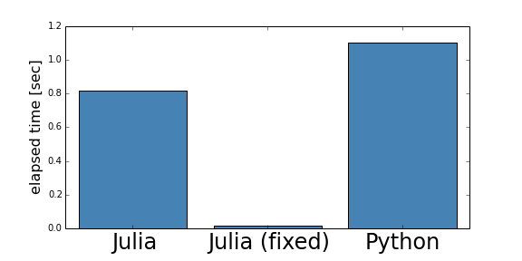

class: center, middle

# What's wrong with this


Kenta Sato (佐藤建太)

Twitter/GitHub: @bicycle1885


---
layout: true

### A Sad Story

<ul style="list-style-type: none; padding-left: 5px;">
    <li> 😆 Is Julia as fast as C/C++? Where is the download link!? </li>
    <li> 😊 Oh, the syntax looks really neat! </li>
    <li> 😃 Ok, it works. Now let's compare it with my Python script. </li>
    <li> 😥 Huh? not so fast as he said, maybe comparable with Python? </li>
    <li> 😒 Julia? Yes, I tried it last month but blahblah... </li>
</ul>

---

---

Prob(their code does something wrong | newbies complain about performance) > 0.95

We are going to learn very basic skills to write (nearly) optimal Julia code from three cases.

---
layout: true

### Case 1

---

.columns[
<div>
.code-wrap[
.watermark.top[Julia 😣]
```julia
s = 0
n = 50000000
for i in 1:n
    s += i
end
println(s)
```
]
.code-wrap.plain[
```
$ time julia case1.jl
real    0m9.859s
...
```
]
</div>

<div>
.code-wrap[
.watermark.top[Python 😆]
```python
s = 0
n = 50000000
for i in xrange(1, n + 1):
    s += i
print(s)
```
]
.code-wrap.plain[
```
$ time python case1.py
real    0m5.998s
...
```
]
</div>
]

<p style="margin: -20px;">

Is Julia slower than Python? Really??
</p>

---
layout: true

### Case 1

.keypoint[**Do Not Write a Heavy Loop at the Top Level!**]

* The top-level code is interpreted, not compiled.
* Top level is not intended to run numeric computation.
* Should be written in a `function`/`let` block.

---

.columns[
<div>
.code-wrap[
.watermark.top[Julia 😣]
```julia
s = 0
n = 50000000
for i in 1:n
    s += i
end
println(s)
```

.code-wrap.plain[
```
$ time julia case1.jl
real    0m9.859s
...
```
]
]
</div>

<div>
.code-wrap[
.watermark.top[Julia 😃]
```julia
*let
    s = 0
    n = 50000000
    for i in 1:n
        s += i
    end
    println(s)
*end
```
]
.code-wrap.plain[
```
$ time julia case1.fix.jl
real    0m0.494s
...
```
]
</div>
]

---


9.859s / 0.494s = 20x faster

---
layout: true

### Case 2

---

.columns[
<div>
.code-wrap[
.watermark.top[Julia 😣]
```julia
function dot(x, y)
    s = 0
    for i in 1:length(x)
        s += x[i] * y[i]
    end
    s
end

n = 10000000
x = zeros(n)
y = zeros(n)
dot(x[1:3], y[1:3])  # compile
```
]
.code-wrap.plain[
```
$ julia -L case2.jl -e '@time dot(x, y)'
elapsed time: 0.814667538 seconds (320013880 bytes allocated, 17.52% gc time)
```
]
</div>

<div>
.code-wrap[
.watermark.top[Python 😏]
```python
def dot(x, y):
    s = 0
    for i in xrange(len(x)):
        s += x[i] * y[i]
    return s

n = 10000000
x = [0] * n
y = [0] * n
```
]
.code-wrap.plain[
```
% timeit dot(x, y)
1 loops, best of 3: 1.1 s per loop
```
]
</div>
]

<p style="margin: -20px;">

</p>

---

.keypoint[**Make Variable Types Stable!**]

* Literal `0` is typed as `Int`.
* Hence Julia assumes the type of the variable `s` is `Int`.
* The element type of `x` and `y` is `Float64`.
* In Julia, `Int + Float64 * Float64` is `Float64`.
* `s += x[i] * y[i]` disturbs the type stability of `s`.

.column-left[
.code-wrap[
.watermark.top[Julia 😣]
```julia
function dot(x, y)
*   s = 0
    for i in 1:length(x)
        s += x[i] * y[i]
    end
    s
end

...
```
]]

.column-right[
.code-wrap[
.watermark.top[Julia 😊]
```julia
function dot(x, y)
*   s = zero(eltype(x))
    for i in 1:length(x)
        s += x[i] * y[i]
    end
    s
end

...
```
]]

---

* Type stability of variables dramatically improves the performance.




* Much less memory allocation and GC time

.code-wrap.plain[
```
$ julia -L case2.jl -e '@time dot(x, y)'
elapsed time: 0.814667538 seconds (320013880 bytes allocated, 17.52% gc time)
```

```
$ julia -L case2.fix.jl -e '@time dot(x, y)'
elapsed time: 0.017035491 seconds (13896 bytes allocated)
```
]

0.814667538s / 0.017035491s = 48x faster

---

* The emitted LLVM code is cleaner when types are stable.

.columns[
<div>
    <figure>
        
        <caption>Type-unstable code</caption>
    </figure>
</div>

<div>
    <figure>
        
        <caption>Type-stable code</caption>
    </figure>
</div>
]

---
layout: true

### Case 3

---

.columns[
<div>
.code-wrap[
.watermark.top[Julia 😭]
```julia
...
function optimize(x0, n_iter)
    η = 0.1
    x = copy(x0)
    g = zeros(length(x0))
    for i in 1:n_iter
        grad!(g, x)
        x -= η * g
    end
    x
end
```
]
</div>

<div>
.code-wrap[
.watermark.top[Python 😜]
```python
...
def optimize(x0, n_iter):
    eta = 0.1
    x = np.copy(x0)
    g = np.zeros(len(x0))
    for i in xrange(n_iter):
        set_grad(g, x)
        x -= eta * g
    return x
```
</div>
]
]

<p style="margin: -20px;">

</p>

---

.keypoint[**`-=` for array types is not an in-place operator!**]

* `x -= η * g` works like:
    * `y = η * g`: product
    * `z = x - y`: subtract
    * `x = z`: bind
* For each iteration:
    * Create two arrays (`y` and `z`) and
    * Discard two arrays (`x` and `y`)
* Lots of memories are wasted!
    * 53% of time is consumed in GC!

```
$ julia -L case3.jl -e '@time optimize(x0, 50000)'
elapsed time: 0.527045846 seconds
    (812429992 bytes allocated, 53.60% gc time)
```

---

.columns[
<div>
.code-wrap[
.watermark.top[Julia 😭]
```julia
...
function optimize(x0, n_iter)
    ...
    for i in 1:n_iter
        grad!(g, x)
*       x -= η * g
    end
    x
end
```
]
</div>

<div>
.code-wrap[
.watermark.top[Julia ğŸ˜]
```julia
...
function optimize(x0, n_iter)
    ...
    for i in 1:n_iter
        grad!(g, x)
*       for j in 1:n
*           x[j] -= η * g[j]
*       end
    end
    x
end
```
]
</div>
]

<p style="margin: -20px;">
    
</p>

---

.columns[
<div>
.code-wrap[
.watermark.top[Julia ğŸ˜]
```julia
...
function optimize(x0, n_iter)
    ...
    for i in 1:n_iter
        grad!(g, x)
*       for j in 1:n
*           x[j] -= η * g[j]
*       end
    end
    x
end
```
]
</div>

<div>
.code-wrap[
.watermark.top[Julia ğŸ˜]
```julia
...
function optimize(x0, n_iter)
    ...
    for i in 1:n_iter
        grad!(g, x)
*       BLAS.scal!(n, η, g, 1)
    end
    x
end
```
]
</div>
]

<p style="margin: -20px;">
    
</p>

---
layout: false

## Take-home Points

* Julia is definitely fast unless you do it wrong.
* You should know what code is *smooth* in Julia.
* [Manual/Performance Tips](http://julia.readthedocs.org/en/release-0.3/manual/performance-tips/) is a definitive guide to know the smoothness of Julia.
* Utilize standard tools to analyze bottlenecks:
    * `@time` macro
    * `@profile` macro
    * `--track-allocation` option
    * `@code_typed`/`@code_lowered`/`@code_llvm`/`@code_native` macros (from higher level to lower)
    * `@code_warntype` (v0.4)
